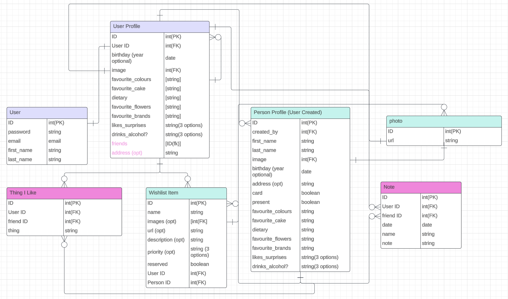

# Project Four - Birthdays
Table of Contents:
+ Project Overview
+ Deployment Link
+ Getting Started/ Code Installation
+ Timeframe & Working Team
+ Technologies Used
+ The Brief
+ Planning
+ Build Process
+ Challenges
+ Wins
+ Key Learnings
+ Bugs
+ Future Improvements

## Project Overview

### Project 4: Birthdays

Birthdays is a diary where you can be reminded of upcoming birthdays, keep track of who you still need to get cards and presents for,  as well as create publicly shareable wishlists and birthday profiles for yourself and others. 

The idea was born from never being able to remember what I want for my own birthday, let alone what to get for others. 

With this app you can also keep track of friends and family’s useful birthday information such as favourite cake, colours,  brands, and even if they like surprises or not.

Birthdays is a full stack application using Python, JavaScript, Django, React.js, PostgreSQL and Django user authentication.

## Find the completed project here: [Birthdays](https://birthdays.up.railway.app/)

## Getting Started/ Code Installation

[GitHub Front End](https://github.com/JoelleLi/Unit4_Project_Frontend)

[GitHub Back End](https://github.com/JoelleLi/Unit4_Project_Backend)

Clone / download the repo.

In terminal run the following commands:

+ Install dependencies ```npm i```
+ In back-end folder, start the server using ```python manage.py runserver```
+ In front-end folder, start the server using ```npm run start```

## Timeframe & Working Team

Seven days, working independently.

## Technologies Used

**Backend**
+ Python
+ Django
+ Django REST Framework
+ PostgreSQL
+ Amazon Web Services S3

**Frontend**

+ JavaScript
+ React.js
+ Axios
+ HTML
+ CSS
+ Tailwind
+ DaisyUI

**Development Tools**
+ VS Code
+ npm
+ Git 
+ GitHub
+ Railway (deployment)
+ Excalidraw
+ Google Chrome dev tools

## Brief

+ **Architect, design and build a full stack web application using Python based Django Web Framework.**
+ **Connect to and perform data operations on a PostgreSQL database.**
+ **Have at least two data entities in addition to the built in user model**, with at least one one-to-many and one many-to-many relationships between entities.
+ **Have full create, read, update and delete data operations**.
+ **Authenticate users using Django’s built-in authentication**.
+ **Implement authorisation** by restricting user access to the creation, updating and deleting of data resources.
+ **Be deployed online** using Railway.
+ The app may optionally **upload images to AWS S3**.

## Planning

To start, I began by drawing up the page views I wanted the app to have and how the data would be displayed. This visual approach helped me to determine exactly what data my ERD was going to contain.

I decided to go for a mobile-first approach to the UI as I imagined the app to be most used on a mobile phone rather than a desktop. I would then work on making the app desktop-responsive if I had time.


I planned out the UI of what the user page views would be when landing on the home page and signing in or logging in. Planning out how data would be displayed and how certain pages would fit into the app UI really helped me to narrow down exactly what was most important to meet the minimum requirements of the project. 

I planned to establish the core functionality of the app first, and then add other features later.


Initially, I had quite a few ideas for the app and drew up an ERD with two extra data entities, Notes and Things I Like (pink headers).

I left these as things that I would work on later, once I had established all the other minimum requirements of the project.

The data entities in my app include:
+ **User** - the default Django User model created on signing up, containing core information such as first name, last name, username and email address.
+ **User Profile** - an extension of the User’s information which is to be created automatically when the user signs up. Can be edited by the user to include information such as birthday, favourite cake, and a profile photo.
+ **Person** - the user can add a birthday profile of a friend or family member, with information such as their address and favourite cake. The data entity will also have boolean fields for ‘card’ or ‘present’.
+ **Wish** - the user or person can have many wishes, and multiple images can be uploaded to a Wish.. The wish will be associated with either a User or Person ID.
+ **Photo** - the photo data model is shared by the User Profile, Person and Wish entities. 



Initially I wanted the favourite colours, favourite cake, favourite brands to be an array of strings, because I wanted the user to be able to add multiple things to each field, and be able to display and edit each item in each field one at a time in the UI.

However I decided to simplify things for the time being and make them simple strings, and add the feature to the list of nice to haves.

## Build/Code Process

### Day 1 
Spending the day planning, I drew up a list of minimum requirements my app would have and a list of ‘nice to haves’.

**Minimum requirements:**
+ Able to edit user profile and upload and change a profile image
+ Able to add, edit and delete a person as well as their profile image
+ Add, edit and delete wishes with multiple images to your own wishlist and to a person
+ Display upcoming reminders for birthdays in the next 30 days
+ Able to share publicly your wishlist, but edit/ delete functions only available to the logged in user
+ Wish should have a boolean ‘reserved’ checkbox, which users can tick and untick even if they are not logged in.

**Nice to haves**
+ A calendar feature on the homepage, flagging upcoming birthdays and a pop-up modal with a link to the person’s profile/ wishlist.
+ An ‘explore’ page displaying the most recent wishes of other users.
+ Possible use of an Etsy API which searches a person’s interests and displays the results for ‘recommended gifts’.

I began by drawing up my desired page views on Excalidraw. I found that knowing what the UI will look like and how data is going to be displayed really helped in deciding what my data entities were going to look like, and also allowed me to refine the required data entities to what was the most important for the basic functionality of the app.

I then created an ERD on Lucidchart, establishing the relationship between the models. As I initially had a lot of ideas for the app, I started out with seven data models including the built in User model. I quickly realised this was too much to start with, and narrowed it down so that ‘Notes’ and ‘Things I Like’ were things I could add at a later point if wanted to develop the app further.

I found it difficult at first to determine the relationships between the data entities, seeing as there were so many links between the models. In particular it was hard to determine which entities would contain foreign keys.

I set up the backend and started to create the UserProfile, Person, Wish and Photo models in VScode, migrating one by one.

### Day 2
Seeing as I wanted a UserProfile to be created automatically when a User signs up, I tried to implement the Login and Signup functionality before attempting anything else. I found this quite difficult as I was not yet used to the Django data models, and it required a lot of further reading of Django documentation.

I decided to fetch the user information using the username, as this would be unique to the user. Initially I found it difficult to store the username when the user logs in, as the login function refreshes the page, therefore losing any stored state.
To get round this I stored the username in local storage.

I managed to get the Login and Sign Up functionality working on the front and back end.

### Day 3
Most of the time spent today was trying to post a User Profile automatically as soon as a User signs up. Because this was my first time using two different languages in the same project (JavaScript in the front end, Python in the back end), I found it quite challenging to marry the two and envision how the data was being sent back and forth.

### Day 4
After figuring out how to post a User Profile successfully, implementing the editing of the User Profile was fairly easy. 

I was quite daunted at the process of trying to implement adding images, so decided to leave this until after I’d cemented the core CRUD functionality of the User Profile and Person. 
I worked on being able to POST a Person and Wish on the front end.

I then tried to add image upload using Amazon Web Services S3. This was quite a challenge initially as there were multiple things I had to add to the settings to get it to work, in particular adding ‘@csrf_exempt’ to each view related to the Photo model.

As AWS was a completely new concept to me, it was quite a challenging process and took a lot of reading to understand what I was doing.


Displaying the images on the front end was also difficult. For the User Profile, the image was a FK(foreign key). I had to fetch the information of the User Profile, and then using the FK of the image, do another fetch to the PK in the Photo model. 

Also, as the Wish could contain multiple images, to display them I looped through the array of foreign keys and performed a fetch for each image to the Photo model one by one. I wasn’t sure if this was the most elegant way of doing this, but it worked, albeit not very fast.

### Day 5
Today I worked on being able to delete and add photos within the ‘edit’ functions of the User Profile, Person, and Wish on the front end.
At first, deleting the image was deleting the whole User Profile or Wish. I initially had the “on_delete=models.CASCADE’, but changed this to ‘on_delete=models.SET_NULL’ and then added a delete function to the UserProfile, Person and Wish models.

In particular it was tricky to edit the images in a Wish, seeing as there could be multiple images associated with a Wish. I decided to add an ‘X’ or delete button on each image, allowing you to delete each image one by one. Likewise, I also added the option to upload one image at a time, adding to the existing array. I then called the fetchData function after each delete or upload, causing the page to re-render and display the most updated set of images.


This however, due to the ‘one by one’ nature of fetching images,  was quite a slow response in the front end  and is something I could work on in the future.

Looking at user permissions, I made the User Profile and Wishlist viewable by anyone who has the link. This involved changing the User, User Profile  and Wish viewsets to ‘permissions.AllowAny’. This meant that anyone who was not logged in could then change the reserved status of the Wish to True or False.

### Day 6 
I created a noticeboard to display on the homepage, letting the User know the birthdays coming up in the next 30 days.


For this I created a ‘NoticeBoard’ component in the ‘Home’ page, which took the ‘’nextBirthdays’ as a prop and displayed a reminder message.


I also worked on the Person profile having a ‘Present’ and ‘Card’ checkbox, and the Wishlist ‘Reserved’ checkbox. I found this process confusing and it took a lot of trial and error to get the checkbox to correctly display the correct information.

### Day 7
I concentrated on styling, using Tailwind and DaisyUI classes. I found it quite challenging to use, as certain features such as Tailwind Typography were working on some pages, but not on others. 

I also worked on deployment, using Railway. The deployed application behaved differently to the locally hosted project. One particular bug is a CORS related error when deleting an image of a Wish, returning an error in the console saying the delete has failed. However, the image does actually get deleted, but the page just does not re-render to display the updated array of images. To get around this I just called ‘fetchData’ after the photo was deleted.

## Challenges

I found working with Amazon Web Services and uploading images extremely challenging, and kept running into various problems. 

I also found learning about and using Django REST authentication extremely difficult, as it required a lot of independent research and reading of documentation. It was hard to pinpoint the right resources to look at in order to find the answers.

I initially found installing and using Tailwind impossible, due to the configuration being wrong.  

## Wins

Even though working with Amazon Web Services for images was a challenge, it worked out really well with my project. In particular I think the functionality of editing and creating wishes was quite successful, paired with a simple yet attractive UI.

Specifically in the edit Wish page, I managed to implement the ability to execute a few different functions whilst still keeping the UI very clean and easy to use.


I think that in general, I was able to create a very user friendly and functional application.


## Key Learnings/Takeaways

I now feel quite confident in using the Django framework. What seemed so alien at first, I now feel quite comfortable with using and am looking forward to creating another project using it.

Another key takeaway is being able to use Amazon Web Services for image upload. Although the process is quite daunting, with a lot that can go wrong, it’s something which can be quite central to a lot of applications functionality and is definitely a learning which will be extremely useful for future projects.

## Bugs

When signing up or logging in, if the fields are filled in incorrectly (password too common or short, username already taken), the user is not notified of what the problem is. 

The reserved status of a Wish cannot currently be changed correctly.

If you are not logged in and click on ‘Me’ in the navbar, it takes you to a profile with a username of ‘null’.

## Future Improvements

+ Add a more detailed ‘About’ section, with links to examples of a filled in Wishlist and User Profile.
+ Add more functionality to the Calendar component on the home page, displaying future birthdays, with a link to the birthday profile.
+ Work on desktop responsiveness.
+ Ensure all functions work correctly on a mobile phone.
+ Make the code more ‘dry’ by using the same page view for the User’s Wishlist and Person’s Wishlist, conditionally rendering information.
+ Add ‘Notes’ and ‘Things I Like’ data entities.
+ Implement an Etsy or Ebay API, where if the user clicks on a Thing in ‘Things I Like’, the results of the first 30 listings relating to the search term is displayed.
